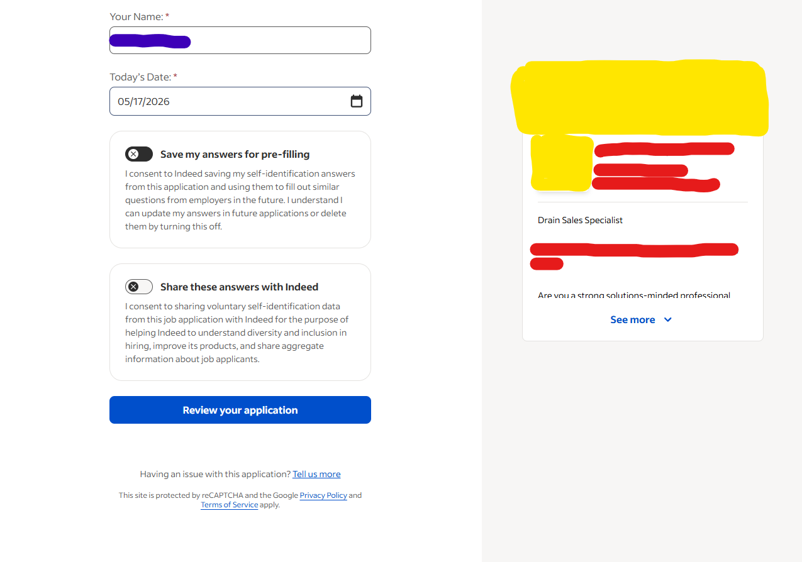
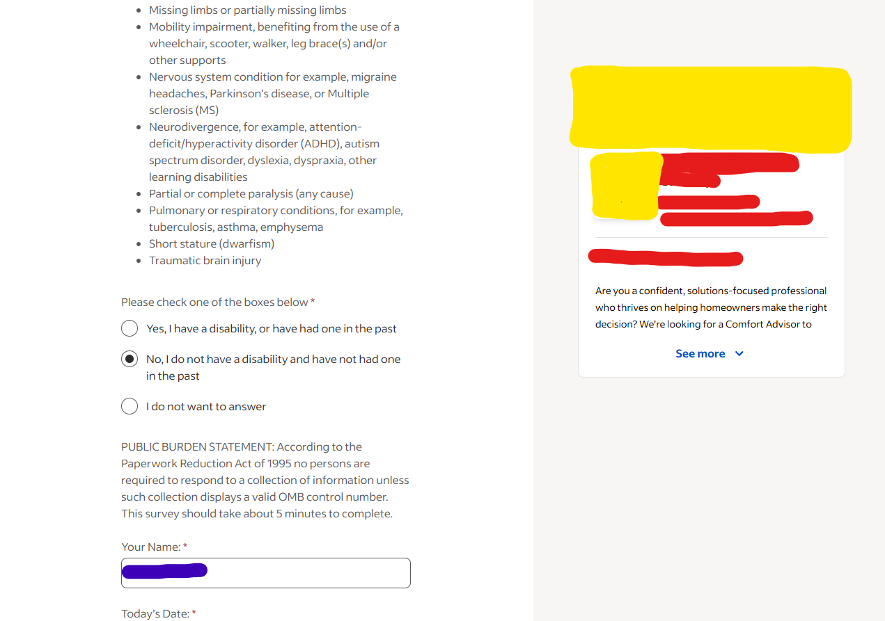
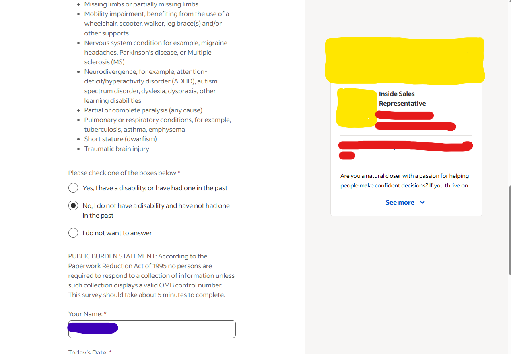

# indeed-agent

Autonomous browser agent that walks Indeed Easy Apply listings end-to-end. Searches jobs from a natural-language prompt, scores matches, fills application forms via a keyword map with a local Mistral/Ollama LLM fallback, and stops at submit in dry-run mode.

## What it does

Give it a prompt like:

```
apply to 10 graphic design jobs in Farmington, MI
```

…and it will:

1. Parse the prompt (role + location + count) via `prompt_parser.py`
2. Search Indeed and collect job cards (`job_searcher.py`)
3. Score each listing against your profile (`job_scorer.py`)
4. Walk the Easy Apply form step-by-step (`form_filler.py`), answering questions from `data/user_profile.yaml` first, then falling back to a local Mistral model via Ollama (`llm_answerer.py`)
5. Stop at the submit button in `--dry-run` mode (never submits real applications unless explicitly allowed)

## Screenshots

Job listing detected on Indeed:


The agent walking an Easy Apply form:







Final review / would-submit step (dry-run halts here):


## Quick start

```powershell
poetry install
poetry run python src/main.py "apply to 10 graphic design jobs in Farmington, MI" `
  --resume "C:\path\to\resume.pdf" --dry-run
```

First run: `poetry run python src/main.py login` to seed the persistent Indeed session in `data/browser_profile/`.

## Architecture

| File | Role |
|---|---|
| `src/main.py` | CLI entry. Parses `--debug`, `--dry-run`, `--resume`. |
| `src/agent.py` | Orchestrator: parse → search → score → apply. |
| `src/browser.py` | Playwright launch, page dumping, screenshots. |
| `src/job_searcher.py` | Indeed search + listing collection + job-detail extraction. |
| `src/form_analyzer.py` | Scans form pages for inputs/selects/textareas/radios. |
| `src/form_filler.py` | Step loop, `FIELD_MAP` keyword table, submit gate. |
| `src/llm_answerer.py` | Local Mistral fallback for unknown fields. |
| `src/field_inventory.py` | Per-run dedup + summary of every field seen. |
| `src/ollama_manager.py` | Auto-starts Ollama, ensures `mistral` is pulled. |

## Safety

`--dry-run` is the default operating mode. `form_filler.click_submit()` is a no-op under dry-run — it logs intent, dumps the final page as `*-would-submit.*`, and returns success. Real submissions require an explicit flag (intentionally not documented here).

## Requirements

- Python 3.11+ via Poetry
- Playwright (auto-installed via Poetry)
- Ollama running locally with the `mistral` model pulled
